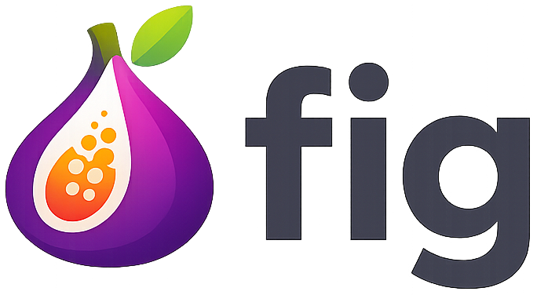

<h1 align="center"> tree-sitter-fig </h1>

<p align="center">
  
</p>

<p align="center">
  
  
  <a href="https://github.com/zap-lang-org/tree-sitter-fig"></a>
</p>

---

# About

`tree-sitter-fig` is a [Tree-sitter](https://tree-sitter.github.io/tree-sitter/) parser for the **Fig programming language**. It allows editors, syntax highlighters, and other tooling to parse and understand Fig source code efficiently.

Tree-sitter provides incremental parsing and a structured syntax tree, making it ideal for syntax highlighting, IDE features, and static analysis.

> ⚠️ The programming language and tree-sitter projects are currently in **early alpha** and primarily intended for hobby and experimentation.

---

# Features

* Parses Fig source code into a concrete syntax tree.
* Supports syntax highlighting in editors that integrate with Tree-sitter (e.g., Neovim, Atom, VS Code).
* Provides a foundation for language-aware tools such as linters, formatters, and code analyzers.

---

# Getting Started

## Using with Tree-sitter CLI

Clone the repository and generate the parser:

```bash
git clone https://github.com/zap-lang-org/tree-sitter-fig.git
cd tree-sitter-fig
tree-sitter generate
```

You can then use the parser in your editor or project.

## Using with Node.js

Install `node-tree-sitter`:

```bash
npm install tree-sitter
```

Then load the Fig parser:

```js
const Parser = require('tree-sitter');
const Fig = require('tree-sitter-fig');

const parser = new Parser();
parser.setLanguage(Fig);

const tree = parser.parse('let x = 42;');
console.log(tree.rootNode.toString());
```

---

# Contributing

Contributions are welcome! Feel free to:

* Improve the grammar and parsing rules
* Add more language constructs
* Integrate with editors for syntax highlighting
* Report issues or suggest features

---

# License

This project is licensed under the **MIT License**. See the [LICENSE](LICENSE) file for details.
